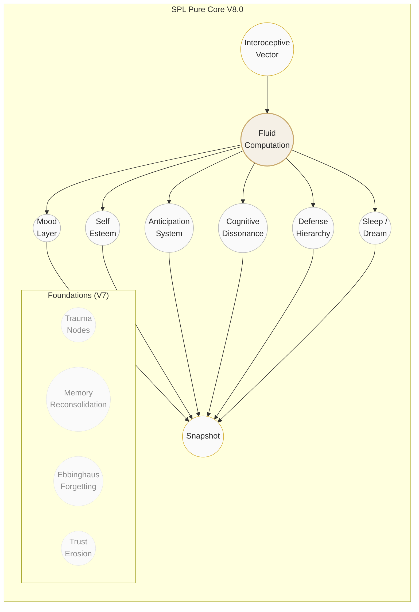

<p align="center">
  <em>The soul does not exist. The mind is not mysterious.</em>
</p>

<p align="center">
  
  
  
  
</p>

---

&nbsp;

## ✦ SPL Pure Core V8.0

A **deterministic, semantics-free anthropomorphic psychology engine** — the universal mental architecture every human shares, separated from any particular character's "soul."

The core simulates emotional inertia, trauma imprinting, memory reconsolidation, suppression-rebound, trust erosion — **without knowing what an "insult" or "compliment" is.**

&nbsp;

## ✦ Universal Psychological Architecture



&nbsp;

## ✦ V8.0 Subsystems

| Subsystem | Model |
|-----------|-------|
| **8-dimension Fluid Field** | Joy · Anger · Fear · Trust · Alienation · Tension · Guilt · Shame |
| **Mood Layer** | Slow background affect (~1h half-life), modulates appraisal gain |
| **Self-Esteem** | ∈ [0,1]; low → internalizes failure, amplifies threat |
| **Sleep / Dream** | Energy recovery + emotional charge decay + fear extinction |
| **Anticipation** | Future hope/threat → fulfillment/volation → surprise/disappointment |
| **Cognitive Dissonance** | Belief-behavior conflict → tension → rationalization |
| **Defense Hierarchy** | Denial → Rationalization → Repression (escalating under load) |

&nbsp;

## ✦ Quick Start

```python
from SPL_anthropic_engine import SPLPureCoreV7_3

core = SPLPureCoreV7_3(psychological_resilience=0.4)

# Inject interoceptive vector (semantics-free)
core.process_vector({"threat": 0.5, "belonging": -0.6, "fatigue": 0.1}, intensity=1.0)

# Set anticipation
core.expect("sign_contract", valence=0.6, confidence=0.7)

# Sleep with dream processing
core.sleep(hours=8)

# Psychological snapshot
snap = core.snapshot()
```

```bash
# Full narrative demo
python sujin-demo
```

&nbsp;

## ✦ Engineering Properties

> **Deterministic** · **Bounded memory** (64 traces, O(1)) · **Pure Python** · **Thread-safe** · **Serializable**

&nbsp;

## ✦ Use Cases

> Game NPCs · Digital Humans · Psychological Simulation · Affective Computing · Interactive Storytelling

&nbsp;

---

<p align="center">
  <a href="https://nohn-ai.github.io/Anthropomorphic-Agent-Engine/">GitHub Pages Demo</a>
  &nbsp;·&nbsp;
  <a href="mailto:ai@nohnlins.com">ai@nohnlins.com</a>
</p>
<p align="center">
  <sub>© 2026 Shanghai Linming Junhua &amp; NOHN AI Technology · All Rights Reserved</sub>
</p>
