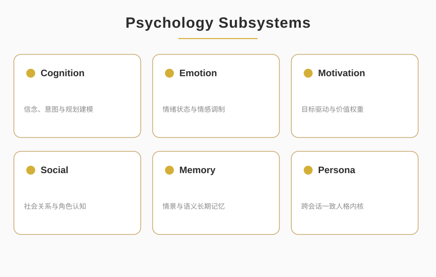

<p align="center">
  
</p>

<p align="center">
  
  
  
</p>

<blockquote align="center">
  <em>Anthropomorphic Psychology · SPL Pure Core V8.0</em>
</blockquote>

<div style="max-width:880px;margin:0 auto;padding:0 16px">

## ✦ About

<p style="font-size:15px;line-height:1.8;color:#2C2C2C">ANTHROPOMORPHIC-AGENT-ENGINE 是基于 SPL Pure Core V8.0 的拟人心理学引擎，将认知、情绪、动机与社会性建模为可组合的子系统。它让 AI 代理具备拟人化的内在状态与一致人格，从而在长期交互中保持行为连贯与情感可信。</p>

<p align="center">
  
</p>

</div>

<p align="center">— ✦ —</p>

## ✦ Quick Start

```bash
git clone git@github.com:NOHN-AI/ANTHROPOMORPHIC-AGENT-ENGINE.git
cd ANTHROPOMORPHIC-AGENT-ENGINE
pip install -r requirements.txt
python run.py
```

<p align="center">— ✦ —</p>

<p align="center">
  <a href="https://github.com/NOHN-AI">NOHN-AI</a>
  &nbsp;·&nbsp;
  <a href="https://www.nohnlins.com/">nohnlins.com</a>
  &nbsp;·&nbsp;
  <a href="mailto:ai@nohnlins.com">ai@nohnlins.com</a>
</p>
<p align="center"><sub>NOHN AI · ANTHROPOMORPHIC-AGENT-ENGINE</sub></p>
