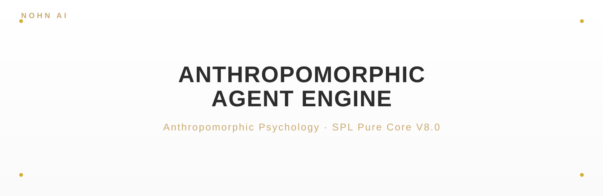

<p align="center">
  
</p>

<p align="center">
  
  
  
</p>

<blockquote align="center">
  <em>拟人心理 · SPL Pure Core V8.0</em>
</blockquote>

<div style="max-width:880px;margin:0 auto;padding:0 16px">

## ✦ 关于

<p style="font-size:15px;line-height:1.8;color:#2C2C2C">ANTHROPOMORPHIC-AGENT-ENGINE 是基于 SPL Pure Core V8.0 的拟人心理引擎。它将认知、情绪、动机与社交建模为可组合子系统，赋予 AI 智能体拟人化的内在状态与一致人格，使其在长期互动中呈现自洽、可信、具情感可信度的行为。</p>

<p align="center">
  
</p>

</div>

<p align="center">— ✦ —</p>

## ✦ 快速开始

```bash
# 主源：GitHub
git clone https://github.com/nohn3043-arch/Anthropomorphic-Agent-Engine.git
# 镜像：Gitee（本仓库）
# git clone https://gitee.com/sjiun/Anthropomorphic-Agent-Engine.git
cd Anthropomorphic-Agent-Engine
# 纯 Python ≥3.8——仅标准库，无需安装
python "SPL-anthropic-engine.py"   # 运行引擎 / 内置演示
```

### 从 PyPI 安装

引擎也已发布到 PyPI，包名 [`spl-agent-engine`](https://pypi.org/project/spl-agent-engine/)：

```bash
pip install spl-agent-engine==0.1.0
```

```python
from spl_agent_engine import SPLPureCoreV7_3
core = SPLPureCoreV7_3()
core.process_vector({"belonging": 0.5, "threat": -0.1}, 1.0)
print(core.snapshot())
```

<p align="center">— ✦ —</p>

## ✦ 核心内容 — SPL Pure Core V8.0

<div style="max-width:880px;margin:0 auto;padding:0 16px">

引擎将通用人类心智架构建模为确定性、连续状态子系统——无 LLM、无随机性、完全可重放：

- **8 维情绪流体**——喜悦 / 愤怒 / 恐惧 / 信任 / 疏离 / 张力 / 愧疚 / 羞耻，每维为带自身目标与基线的连续状态。
- **创伤与记忆**——创伤节点、记忆再巩固、艾宾浩斯式遗忘、压抑–回弹与内隐压力雪崩。
- **信任与关系**——信任容量腐蚀（慢性冷遇使 `max_trust` 衰减）。
- **心智代谢**——兴奋–唤醒、动态黏度、心理时间、能量–疲劳代谢，以及用于测试与重放的虚拟时钟。
- **V8.0 扩展**——慢变量*情绪*层、独立于愧疚的*羞耻*维度、自尊动力学、睡眠 / 梦境处理（REM 巩固 + 恐惧消退 + 睡眠债）、*预期*系统（希望 / 焦虑 / 失望）、认知失调，以及扩展防御机制（否认 / 合理化 / 置换）。

</div>

## ✦ 可组合模块

<div style="max-width:880px;margin:0 auto;padding:0 16px">

| 模块 | 文件 | 职责 |
|---|---|---|
| 叙事映射器 | `SPL-anthropic-engine.py` | 外部、可替换的人格层（乐观 / 偏执 / 厌世），将事件翻译为内感受向量。 |
| 身份引擎 | `feature/Identity module.py` | 多身份模型；身份冲突注入持续基线张力。 |
| 目标 / 价值 / 偏见 / 世界 | `feature/*.py` | 可组合驱力、估值、认知偏见与世界模型先验。 |

</div>

<p align="center">— ✦ —</p>

## ✦ 使用

<div style="max-width:880px;margin:0 auto;padding:0 16px">

引擎文件按设计使用连字符命名，直接加载（或作为脚本运行）：

```python
import importlib.util
spec = importlib.util.spec_from_file_location("spl_core", "SPL-anthropic-engine.py")
spl = importlib.util.module_from_spec(spec); spec.loader.exec_module(spl)

core = spl.SPLPureCoreV7_3()
# 外部事件由（可替换的）人格层映射为内感受向量
vec = spl.NarrativeMapper.map_event("insult", intensity=1.0)
# 将 `vec` 馈入 `core`，随时间演化情绪 / 信任 / 创伤状态
```

</div>

<p align="center">— ✦ —</p>

## ✦ 项目结构

```
ANTHROPOMORPHIC-AGENT-ENGINE/
├── SPL-anthropic-engine.py     # 核心引擎 + NarrativeMapper
├── feature/                    # Goal / Identity / value / world / bias / language-style 模块
├── sujin-demo/                 # 参考演示素材
├── assets/                     # banner.svg, overview.svg
└── docs/index.html
```

<p align="center">— ✦ —</p>

## ✦ 在线演示

<p align="center">
  <a href="https://www.nohnlins.com/your-soulmate/">
    
  </a>
</p>

交互式演示：**<https://www.nohnlins.com/your-soulmate/>**

<p align="center">— ✦ —</p>

## ✦ 生态

ANTHROPOMORPHIC-AGENT-ENGINE 是 NOHN AI 生态的一员——围绕第二视角因果审计与确定性执行构建的项目家族：

| 项目 | 仓库 | 定位 |
|---|---|---|
| **Second-Perspective (GCAE)** | [nohn3043-arch/second-perspective](https://github.com/nohn3043-arch/second-perspective) | 全局认知审计引擎——五算子因果审计内核（IMDA 95/100） |
| **NOMOS** | [nohn3043-arch/second-perspective](https://github.com/nohn3043-arch/second-perspective)（`Intelligent-Decision-Hub--Nomos` 分支） | 可审计确定性决策中心（IMDA 95/100） |
| **SPL-G1** | [nohn3043-arch/SPL-G1](https://github.com/nohn3043-arch/SPL-G1) | 硬件因果审计可信计算单元（TCU） |
| **SPL-Virtual-World-Base** | [nohn3043-arch/Second-Reality](https://github.com/nohn3043-arch/Second-Reality) | 虚拟世界与元宇宙基础设施（宪法 / 法律 / 桥梁） |
| **Story-Engine** | [nohn3043-arch/story-engine](https://github.com/nohn3043-arch/story-engine) | 长篇叙事一致性引擎 |
| **Antares** | [nohn3043-arch/Antares](https://github.com/nohn3043-arch/Antares) | GFSIP v1.0——带因果审计的联邦稳定互操作协议 |
| **Anthropomorphic-Agent-Engine** | [nohn3043-arch/Anthropomorphic-Agent-Engine](https://github.com/nohn3043-arch/Anthropomorphic-Agent-Engine) | 确定性拟人心理引擎（SPL Pure Core V8.0） |
| **PAGES** | [nohn3043-arch/pages](https://github.com/nohn3043-arch/pages) | NOHN AI 生态官方落地页 |

<p align="center">— ✦ —</p>

## ✦ 许可与授权

本仓库**非开源**，采用双轨模式：个人非商业研究免费；政府 / 企业需付费商业授权。详见 [LICENSE](./LICENSE) 完整条款——许可人与适用法律按用户所在地确定。

- **申请授权**：国际 / 全球 — [ai@nohnlins.com](mailto:ai@nohnlins.com) · 中国 — [lin@secondai.top](mailto:lin@secondai.top)

<p align="center">
  <a href="https://github.com/nohn3043-arch">GitHub</a>
  &nbsp;·&nbsp;
  <a href="https://www.nohnlins.com/">nohnlins.com</a>
  &nbsp;·&nbsp;
  <a href="mailto:ai@nohnlins.com">ai@nohnlins.com</a>
</p>
<p align="center"><sub>NOHN AI · ANTHROPOMORPHIC-AGENT-ENGINE</sub></p>
